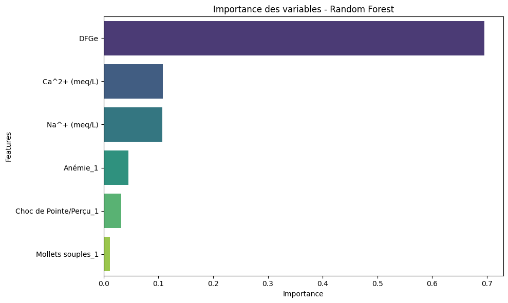
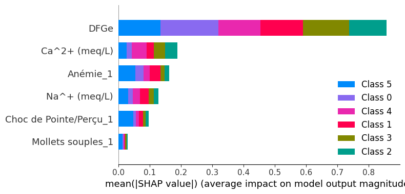

# AI4CKD-API
This project was developed as part of the AI4CKD hackathon, aiming to leverage artificial intelligence for the prediction of chronic kidney disease (CKD) stages. Using real clinical data from patients at CNHU-HKM , we built machine learning models capable of identifying CKD progression from biological and risk factor profiles. The solution integrates robust preprocessing, feature selection (RFE), hyperparameter optimization, and interpretable classification models to assist healthcare professionals in early diagnosis and personalized monitoring. Through this initiative, we contribute to predictive and proactive nephrology, with the long-term goal of improving patient care and reducing complications.A FastAPI-based web service deployed on Google Cloud Run through Github Actions is provided to expose the trained model for real-time predictions, allowing external applications or clinicians to submit patient data and receive instant stage predictions in a secure and scalable way 

 Google Cloud Run : https://ai4ckd-844747804346.us-central1.run.app/docs
## Features Importance


## Model Explanation


## Development Requirements

- Python 3.11+
- Uv (Python Package Manager)

### M.L Model Environment

```sh
MODEL_PATH=artefacts/models
MODEL_NAME=modele_rf.pkl
ARTEFACT_PATH=artefacts
```

### Update `/predict`

To update your machine learning model, add your `load` and `method` [change here](app/api/routes/predictor.py#L19) at `predictor.py`

## Installation

### NB : Install Make on Windows
Install Chocolatey from here https://chocolatey.org/install

Then run ```choco install make```  from a fresh terminal.

Now run make from another new terminal.

```sh
pip install uv --break-system-packages
python -m venv venv
source venv/bin/activate
make install

```


### Runnning API Localhost


`make run`


### Running Tests

`make test`

### Access Swagger Documentation

> <http://localhost:8080/docs>

### Access Redocs Documentation

> <http://localhost:8080/redoc>


## Future Improvements

To further enhance the robustness and scalability of this solution, several improvements are envisioned:

-  Monitoring Data & Model Drift during Inference: Implement continuous monitoring to detect distribution shifts in input data or degradation in model performance. In the event of significant drift, the system could trigger an automated retraining pipeline to ensure the model remains accurate and clinically relevant over time.

- Prototyping Federated Learning: Explore decentralized training strategies that enable collaborative learning from clinical data across multiple hospitals or labs, without exposing sensitive patient information.

- Better End-to-End Automation: Design a fully automated and reproducible machine learning workflow, covering data validation, model versioning, retraining triggers, and production deployment with minimal manual intervention.

## Project structure

Files related to application are in the `app` or `tests` directories.
Application parts are:

    app
    |
    | # Fast-API stuff
    ├── api                 - web related stuff.
    │   └── routes          - web routes.
    ├── core                - application configuration, startup events, logging.
    ├── models              - pydantic models for this application.
    ├── services            - logic that is not just crud related.
    ├── main-aws-lambda.py  - [Optional] FastAPI application for AWS Lambda creation and configuration.
    └── main.py             - FastAPI application creation and configuration.
    |
    | # ML stuff
    ├── data             - where you persist data locally
    │   ├── interim      - intermediate data that has been transformed.
    │   ├── processed    - the final, canonical data sets for modeling.
    │   └── raw          - the original, immutable data dump.
    │
    ├── notebooks        - Jupyter notebooks. Naming convention is a number (for ordering),
    |
    ├── ml               - modelling source code for use in this project.
    │   ├── __init__.py  - makes ml a Python module
    │   ├── pipeline.py  - scripts to orchestrate the whole pipeline
    │   │
    │   ├── data         - scripts to download or generate data
    │   │   └── make_dataset.py
    │   │
    │   ├── features     - scripts to turn raw data into features for modeling
    │   │   └── build_features.py
    │   │
    │   └── model        - scripts to train models and make predictions
    │       ├── predict_model.py
    │       └── train_model.py
    │
    |────artefacts   - .pkl files for models, scalers ..
    |
    └── tests            - pytest


